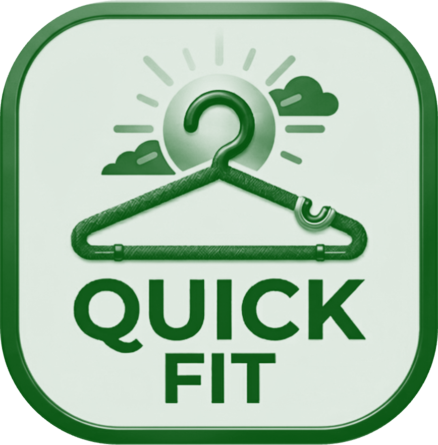

  
  
<em>Smart outfit planning for real life mornings</em>

---

<strong>Created for the OpenAI x Handshake Codex Creator Challenge.</strong>

QuickFit is a weather-aware outfit planning web app that helps users get dressed faster and feel more confident by combining the forecast with their own closet.

---

## Table of Contents

1. [Project Overview](#project-overview)
2. [Why I Built It](#why-i-built-it)
3. [What QuickFit Does](#what-quickfit-does)
4. [How It Works](#how-it-works)
5. [App Pages](#app-pages)
6. [Wardrobe Model Outline](#wardrobe-model-outline)
7. [Personalization](#personalization)
8. [Submission Details](#submission-details)
9. [Current Build Focus](#current-build-focus)

---

## Project Overview

QuickFit started from a very real morning problem: not wanting to check the weather and not wanting to spend extra time planning an outfit. The idea was simple: what if a helper understood my wardrobe and built a weather-aware outfit for me? That moment became the foundation for QuickFit. 👗🌤️

QuickFit helps users choose what to wear quickly and confidently by combining:
- Live weather signals 🌤️
- Seasonal context 🍂
- Closet organization and style tags 👚

The product direction is simple: reduce outfit decision fatigue without sacrificing personal style.

---

## Why I Built It

QuickFit is designed for people who:
- Forget to check the weather before leaving home
- Are unsure how to style outfits
- Do not have time to plan clothing combinations in advance

The goal is to turn a daily routine into a faster, easier decision without making the experience feel complicated or generic.

---

## What QuickFit Does

- Reads weather and season context
- Lets users organize a digital closet
- Suggests outfit combinations based on the day
- Supports style and occasion-based filtering

---

## How It Works

1. User opens QuickFit.
2. The app checks weather and season.
3. The user selects a theme for the day.
4. QuickFit suggests an outfit from saved clothing items.
5. The user previews the look on a mannequin and finalizes it.

---

## App Pages

| Page | Purpose | Key Elements |
|------|---------|--------------|
| Main Page (Mannequin View) | Outfit recommendation and visual preview | Mannequin display, weather summary, season context, suggested combinations |
| Closet Manager (Add/Remove Clothes) | Clothing inventory management | Add item, remove item, classify by color/type/style/material/theme |
| User Profile (Optional) | Recommendation personalization | Temperature preference, style preference, gender preference |

---

## Wardrobe Model Outline

### Clothing Fields

| Field | Description |
|------|-------------|
| Color | Primary item color |
| Type | Garment group (dress, shirt, skirt, etc.) |
| Style | Visual/style descriptor, including length when relevant |
| Material | Fabric or blend (denim, cotton, etc.) |
| Theme | Occasion fit (casual to professional) |

### Supported Clothing Types and Style Examples

| Type | Examples |
|------|----------|
| Dress | Floral, floor-length |
| Shirt | Blouse, t-shirt, button-up |
| Skirt | Flowy, dance, A-line |
| Shorts | Mini, knee-length |
| Pants | Flare, straight, skinny |
| Outer Layer | Jacket, coat, vest |
| Accessories | Hats, sunglasses, jewelry |

### Theme for the Day

- Casual
- Formal
- Semi-formal
- Professional

---

## Personalization

Profile preferences, planned as an optional expansion, can include:
- Runs hot or runs cold
- Style preference
- Male/female preference

These settings help tailor recommendations without making onboarding heavy. ⚙️

---

## Submission Details

This section maps QuickFit to the contest requirements.

| Requirement | QuickFit |
|-------------|----------|
| Project title | QuickFit |
| What the project is | A weather-aware outfit planning web app |
| Why I built it | To make mornings easier by reducing outfit decision fatigue |
| How I built it | By combining weather, season, closet data, and outfit suggestion logic |
| Project link / URL | Add your deployed app or repository URL before submission |
| Built with Codex | Select the checkbox during submission |

The contest rubric also rewards clarity, usefulness, creativity, execution, and polish. This README is structured to support those areas, but the app itself still needs to be stable and demo-ready to score well on execution.

---

## Current Build Focus

- Deliver the main mannequin experience with weather + season inputs
- Build closet add/remove flows with clean item tagging
- Ensure users can get a usable outfit suggestion in seconds

QuickFit is being shaped as a practical styling assistant: fast, clear, and easy to trust. ✨
